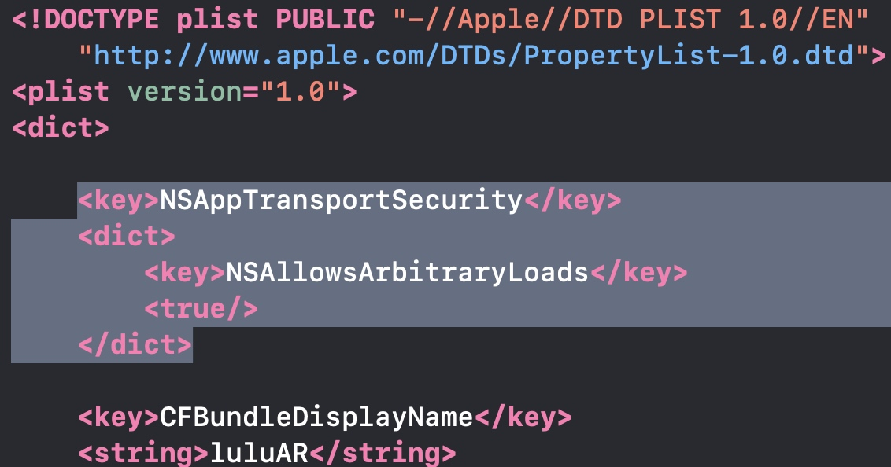
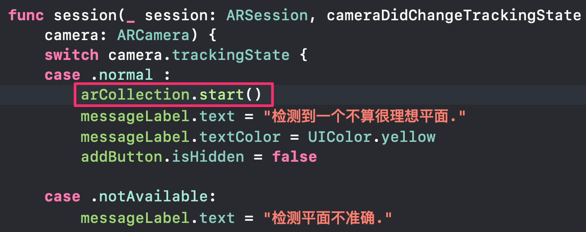

# AR应用监控使用指南
## 一、准备工作
### 1.1、获取appId
* 注册一个用户帐号，创建一个对应的APP应用，创建完成后会生成一个唯一标识符appId，请记下这个标识符，在后面的APP开发中会使用到。

### 1.2、集成SDK
* 可使用CocoaPods进行集成(强烈推荐)，Podfile中添加以下依赖：

        source 'https://github.com/CocoaPods/Specs.git'
        source 'https://github.com/happy-yuxuan/ARPodSpecs.git'
        target '项目的名字' do
          pod 'ARInfoBox', '~> 0.0.5'
        end

* 配置完成后，在项目根目录下使用**Terminal**执行`pod install`
* **注：因为支持ARQuickLook， iOS Deployment Target 最好为12.0以上：**

### 1.3、修改.plist文件
* 目的：增加访问http的权限（i-test请求为http），iOS默认状态只能访问https。

#### 第一步:
* 找到自己.plist文件,默认名为Info.plist。
* 右键在Info.plist文件中选择 Open As - Source Code。

#### 第二步
* 粘贴以下内容：
        
        <key>NSAppTransportSecurity</key>
    	<dict>
    		<key>NSAllowsArbitraryLoads</key>
    		<true/>
    	</dict>

* 注意粘贴位置： 
        

* Command + S 保存即可.

## 二、开始使用
### 2.1 import ARkit
* 在ViewController（使用ARKit中的Controller）导入ARKit和**ARInfoBox**（本监控工具）
        
        import ARKit
        import ARInfoBox

### 2.2、实现代理方法

* 在ViewController实现代理方法 **ARSCNViewDelegate** 
* 在ViewController中声明一个**ARInfoController**的变量

        var arCollection: ARInfoController = 
                ARInfoController.init(appId: "[用户的appId]")

### 2.3、通过appId初始化
* appId位于i-test中AR应用监控管理的应用ID中
* 即上图初始化代码为：
        
        var arCollection: ARInfoController = 
                ARInfoController.init(appId: "85d4a553-ee8d-4136-80ab-2469adcae44d")

### 2.4、启动SDK
* 选择一，直接在ViewController - **viewDidLoad()**中启动

        arCollection.start()
        
* 选择二，当代码中有实现ARSCNViewDelegate代理方法**session()**的时候，可以在相机**camera**状态为**.normal**的时候启动**这样的做法可以减少收集系统无用的数据。例如当相机处于准备阶段的时候是不需要收集数据。**

## 三、接口集成
### 3.1、用户数据上报
* 应用使用情况、用户设备信息、运行时性能可自动上报，无需进行额外配置。

### 3.2、凝视模型时间上报
* 如果您想监控模型凝视时长，请使用**ARInfoController实例arCollection**提供方法。我们提供了如下的上报接口，您可以根据自己的需求在合适的时机上报：

        arCollection.uploadGazeObject(modelName: String, gazeTime: Int)
        
  参数modelName为模型名字，gazeTime为用户凝视时间。
  **注：以下arCollection均为ARInfoController同一个实例。简洁起见，顾不重复赘述。**

### 3.3、频繁交互序列上报
* 如果您想要监控频繁交互序列，请使用我们提供如下接口进行上报：（ [Action]为一个枚举类型的数组 ）

        arCollection.uploadTriggerCount(modelAction: [Action])
        

* **注： Action内部为动作类型的枚举，枚举用户常用动作（Scaling、Rotate、Add）用户想添加自定义动作可对Action自行扩展，Action内部结构格式为：**

        public enum Action {
            case Scaling, Rotate, Add
        
            var description: String {
                switch self {
                case .Scaling: return "缩放(Scaling)"
                case .Rotate: return "旋转(Rotate)"
                case .Add: return "放置(Add)"
                }
            }
        }

* 自定义行为扩展举例：

        extension Action {
            enum 自定义行为 {
                case 自定义行为
            }
        }
        // 获取刚刚定义的行为
        Action.自定义行为

### 3.4、 触发行为次数上报
* 如果您想要监控行为次数，我们提供了如下的上报接口，您可以根据自己的需求在合适的时候上报：

        arCollection.uploadTriggerCount(modelAction: [Action])
        
* **祝： 每次触发行为时， 添加对应Action动作或[3.3节中的自定义行为](#3.3)， 最后通过此接口上报服务器。**
